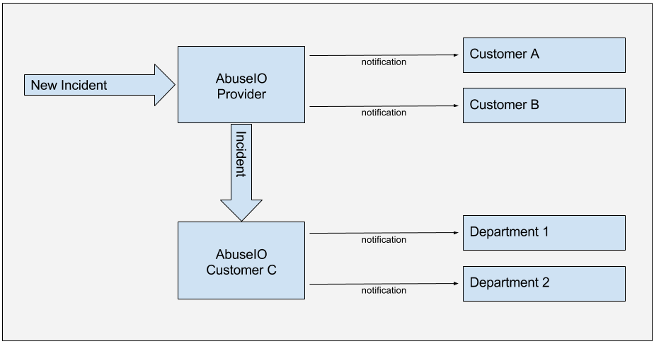
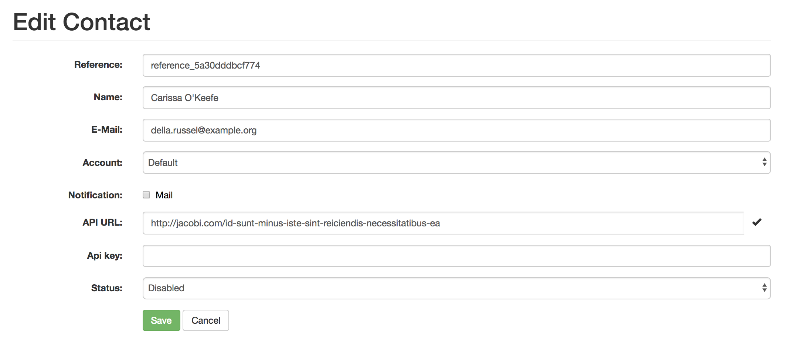
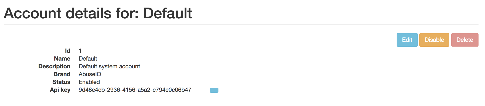

# Delegation between AbuseIO instances

## Overview
It is possible to delegate tickets to another AbuseIO instance, this can be useful if you, as provider, have a customer which has it's own AbuseIO.

 
Here the provider receives an incident for Customer A, B and C. The contact for Customer C has his own AbuseIO instance and the incident gets delegated to his instance.
Customers A and B receive a notification (most likely an email).

Customer C receivers the incident and sends out a notfication to the contact (department 1 / 2).

## How to config

First we need some info about the child instance.
 - the API url
 - the API key of the system account
 
#### API url
The API url is normally http://{APP_URL}/api/v1. In the parent AbuseIO, go to the correct Contact and
paste the child's API url in the corresponding field. You can press the '?' button to check if the 
parent can connect to the child's API url.
 

#### API key
AbuseIO delegation uses the API to delegate the tickets, therefor we need to have the system accounts API key from the child instance.
You can find it by the Account details of the system account ('Default' account by a new installation).
Save the key in the corresponding field and the instances are linked.

## Using delegation
When you receive an ticket for a netblock linked to a contact which has it's own AbuseIO instance, AbuseIO will delegate the ticket to the child instance.
The child instance will create a new ticket (or link it to an existing ticket). In the ticket view by the Child there is a link back to the ash page of the parent.
The Contact can use this page to talk to the abusedesk of the parent AbuseIO. When the ticket is closed in the child instance it will change the contact_status in the parent instance to Resolved.
Only the parent instance can close the ticket, the parent statuses changes are synced downwards.
