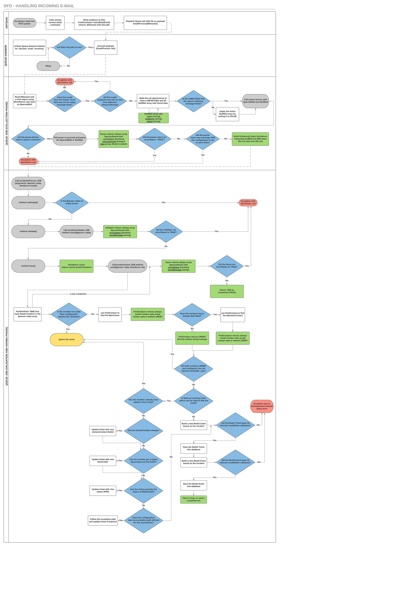

# Development Guide

This document is far from complete and should be considered a work in progress!

# Preface

This document will describe how to get started on development within the AbuseIO framework and
its libraries. 

# Before you start

First off (and please read carefully to avoid disappointments later on) have a look in our GIT
trees to see wither it was not already build, but not (yet) included with a default AbuseIO 
installation. Some elements will always remain optional to install, but do exist.

Second, and this applies very much to any parser, collector or submodule, please check wither
a near-similair item exists and can be expanded. Although AbuseIO is ment to be modular having
a gazillion packages while most could be combined into generic parsers we hope to keep the
repository as tidy as possible.
If you have build a parser, don't worry and just submit your code. The AbuseIO Core team will
help you with the integration of it.

Also when working with parsers (or any kind of development) you need to be aware that Laravel
caches the framework. Therefor classes, autoloaders, but also configuration files are cached
and you will need to reload them regurally to make sure it reflects your development. If you
are developing we'd suggest removing the -daemon option from all the supervisored processes so
all your changes are updated in realtime as much as possible.

In addition adding samples is compulsary! This is the only way to know if a parser still works.
Adding samples are static files, if you are using old samples with an old timestamp the aggregator
might refuse to accept them. Make sure your samples have up-to-date timestamps or update the 
configuration to accept very old reports.

Finally let us know that you are working on something, this way we can help you and make sure
others are not starting on duplicate work. We have an IRC channel were already a lot of
developers are chatting and could be of help while you are developing on your own.

# Building a parser (or collector)

Aren't these things just magical? At one moment they're mere e-mails and with some fairy dust
you end up with incidents, events and tickets! Now lets see how deep the rabbit hole could go?

## Intended inner workings

To start off you might want to have a look and the DFD i've built, which can be found here:



For this section you can skip the Artisan and Queue Daemon parts as they are not really involved
with a parser. When an e-mail is received it is put into a queue and every 'run cycle', jobs are 
processed from that queue. This is where the first fairy dust is thrown.
After some basic e-mail validation the e-mail is split into several elements:

<code>$this-&gt;parsedEmail</code> this contains the original email (PhpMimeMailParser) object for you to
use as you wish. E.g. swift through attachments and collecting data along the way

<code>$this-&gt;arfMail</code> [evidence, message, report], this contains a preparsed email object with
the ARF elements. This way you dont need to parse it if it is default ARF and you can just start
working on the ARF data.

So at this point the job is being processed and the e-mail/arfmail is built. Based on this
data a first decision is made on which parser should be used for this e-mail. This is done by
two config elements from your parser. So lets start by building an empty parser.

## The parser template

Starting off with a parser is not that hard, you need to know a few things first. Each parser
has a required source and config file. The format for these files is fixed and cannot be changed
due to the calling of these classes. Also the config will be added to the main AbuseIO config
tree, so you want to make sure you are building this correctly to avoid weird behaviour.

Assuming you have a default and up to date AbuseIO installation in /opt/abuseio/ you can go to the
dir /opt/abuseio/vendor/abuseio/. This is the dir where packagist will eventually install your
newly created parser once completed. For now we are manually placing it so you can live test it
before committing it:

```sh
cd /opt/abuseio/vendor/abuseio
mkdir parser-myfirst/src
touch parser-myfirst/src/Myfirst.php
mkdir parser-myfirst/config
touch parser-myfirst/config/Myfirst.php
                            ^^^^^^^^^^^ First letter upper, the rest lowercase
      ^^^^^^^^^^^^^^ all lower case
```

Now have a look at these two examples:
https://github.com/AbuseIO/parser-arf/blob/master/config/Arf.php
https://github.com/AbuseIO/parser-arf/blob/master/src/Arf.php

For the parser to be included at all you need a minimum of having the namespace, Incident model 
and the class name extended properly. That sounds a lot, but actually it's just this:

```PHP
<?php
namespace AbuseIO\Parsers;
use AbuseIO\Models\Incident;
/**
 * Class Myfirst
 * @package AbuseIO\Parsers
 */
class Myfirst extends Parser
      ^^^^^^^ Must match filename without extension (.php)
{
public function __construct($parsedMail, $arfMail)
    {
        parent::__construct($parsedMail, $arfMail, $this);
    }

public function parse()
    {
    }
}
```

For the configuration file it's a bit more complex, so ill fully go through all the options:

```PHP
return [
    'parser' => [
        // The name of the parser, should match filename without extension (.php)
        'name'          => 'Myfirst', 
        // Wether this parser is enabled. If false its config is entirely ignored in the main
        // config tree and will never be called
        'enabled'       => true,
        // Sender mappings with look in the EMAIL FROM header based on a regular expression
        // to match it. If it's a match this parser will be selected
        'sender_map'    => [
            '/addr@myfirst.net/',
        ],
        // Same as sender mapping, but then based on the EMAIL BODY text.
        'body_map'      => [
            '/my first notification/',
        ],
        // The aliases convert the body_map address into a more friendly source name
        // or convert feed names.
        'aliases'       => [

        ]
    ],
    'feeds' => [
        // There is always a feed, if there is just one then it's 'default' but you can
        // name them as you like, but referring to data sources would be handy. The name
        // is used by the method (COMMON)$this->isKnownFeed() so see if the feed you selected
        // really exists.
        'default' => [
            // Classification for incidents to be when this feed is used
            'class'     => 'SPAM',
            // Type for incidents to be when this feed is used
            'type'      => 'ABUSE',
            // Wither this feed is enabled by using (COMMON)$this->isEnabledFeed()
            'enabled'   => true,
            // The minimum required fields your info blob should end up with, which will be
            // validated later by using (COMMON)$this->hasRequiredFields($report)
            'fields'    => [
                'Source-IP',
                'Feedback-Type',
                'Received-Date',
            ],
        ],
    ],
];
```

Once you have finished building these two files it is time to make the framework know your 
new parsing class:

```sh
php artisan cache:clear
php artisan clear-compiled
php artisan optimize
```

Now what just happend? Because of the autoloading functions and you clearing its cache
it has build a new autoloader. This autoloader has now included your parser with its class
making it accessable in the framework. With your config (body/sender map) it's calling 
your Myfirst class and parse method. Just feed a e-mail matching the config conditions
into the framework and you'd see this Myfirst parser is called.
To kick a e-mail into the frameworking with some debugging you only need to call upon
the email:receive CLI command and passing the option --noqueue, for example:

```sh
cd /opt/abuseio
cat /home/awesomedev/Myfirst-samples/email.eml | php -q artisan email:receive --noqueue
```

This will read the email.eml file and pushes it into the receiver. If configured correctly
you should see something like this in your /var/log/abuseio/framework.log

```sh
abuseio[x]: local.INFO: AbuseIO\Parsers\Myfirst: Received message from: addr@myfirst.net with subject: 'Bad people email' arrived at parser: Myfirst
abuseio[x]: local.INFO: AbuseIO\Parsers\Myfirst: Parser run completed for module : Myfirst
abuseio[x]: local.INFO: AbuseIO\Jobs\IncidentsValidate: Validator has ended without errors
```

Well the last line might say failed validations, but we'll discuss that later.
At this point you have a working and callable parser and you can type your main code into the @parse() method.


## The common libraries

Every parser has a lot of the same code. To keep this code in sync we provide
the 'parser-common' class which is extended on your own Myfirst class. It
contains a lot of methods which at some point should be documented in full, but
if you look at these files:

https://github.com/AbuseIO/parser-common/blob/master/src/Factory.php

https://github.com/AbuseIO/parser-common/blob/master/src/Parser.php

And it will give you a general impression on what is already available in sense of creating work dirs, storing
data and doing validations. If you look back at the ARF example shown in the beginning you'd have a good 
starting point/idea on how it could be implemented for Myfirst's class (but copy/pasting stuff usually works too).

## The Incident model

While everyone can make their own parser, the core needs to validate the data on its own. A parser might be broken and
you would not want bad data to be actually stored. To bridge this a parser will only build 'incidents' and does not
do validation. The framework will do this for you.

```PHP
 // At some point set the feed name (it is later used to pull class, type and report validation)
 $this->feedName = 'default';
 ...
 $incident = new Incident();

 // Name of the origin, e.g. Myfirst reporting agency
 $incident->source      = $this->parsedMail->getHeader('from');

 // Just leave it for now, this is future API callback implementation
 $incident->source_id   = false;

 // The IP (required)
 $incident->ip          = $report['Source-IP'];

 // The domain (optional)
 $incident->domain      = false;

 // Class/Type should be pulled from your config, so it can be changed without a code change
 $incident->class       = config("{$this->configBase}.feeds.{$this->feedName}.class");
 $incident->type        = config("{$this->configBase}.feeds.{$this->feedName}.type");

 // Timestamp of the incident has happend (e.g. timestamp of the sent SPAM on a mail log) 
 $incident->timestamp   = strtotime($report['Received-Date']);

 // A json encoded report, freeform and fillable with all your parsed data. All fields are optional
 // unless these fields are set in the 'fields' configuration, making them a required part.
 $incident->information = json_encode($report);

 // Now store it with all the incidents parsed.
 $this->incidents[] = $incident;

 // Done/return
```

## Passing along errors to IncidentProcess

You MUST NOT use 'die', or do stuff with errors on your own. If you cant parse it you
can used the following 'exits' when your method is done (trying):

```PHP
 // Return OK with parsed completed (even with warnings, it says your job is done)
 return $this->success();

 // Return a hard fail, data is fully ignored and job will be stuck in the queue
 return $this->failed($message);
```

So your parser does the work it was set out to do, or it fails entirely. There is middle ground, by increasing an 
error counter (<code>$this-&gt;warningCount++;</code>) when you catch a problem but it is not critical. For example with having 
100 incidents and only 1 failed, then you have 99 incidents in the pool ready to return to the framework and 1
warning (logged). It's up to the user (admin) to configure wither this is importent enough to fail the job or just
to log the 1 error and continue with the 99 working incidents(default). It will allow partial processing of events.

Don't worry, if you want to get that last event you can simply 'replay' that e-mail into the queue when you fixed
your parser. Still 100 events will be generated by the parser, however when processing in the framework AbuseIO
will notice there are duplicates and will ignore 99 incidents and only be adding 1.

In addition collectors might get soft warnings because there was no data to parse. This is not really and error, 
because your IP might f.e. not be listed on a blacklist at all, and with its collection of the RBL you'd get
no results.

Once you call <code>$this-&gt;success/failed</code> you return the control of
the job back to the framework which will start validations (are all your
objects correctly formed, etc) and will generate logs what has become of them.

In the DFD this is the Validation and saving phase.

Example logs when job returns to framework:

```sh
abuseio[x]: development.INFO: AbuseIO\Parsers\Myfirst: : Parser completed with 0 warnings and collected 1 incidents to save
abuseio[x]: development.DEBUG: AbuseIO\Jobs\IncidentsSave: has completed creating 1 new tickets, linking 1 new incidents and ignored 0 duplicates
abuseio[x]: development.INFO: AbuseIO\Parsers\Myfirst: : Parser completed with 0 warnings and collected 1 incidents to save
abuseio[x]: development.DEBUG: AbuseIO\Jobs\IncidentsSave: has completed creating 0 new tickets, linking 0 new incidents and ignored 1 duplicates
```

This is an example where i pushed the e-mail in twice and the 2nd time it ignored the duplicate.
